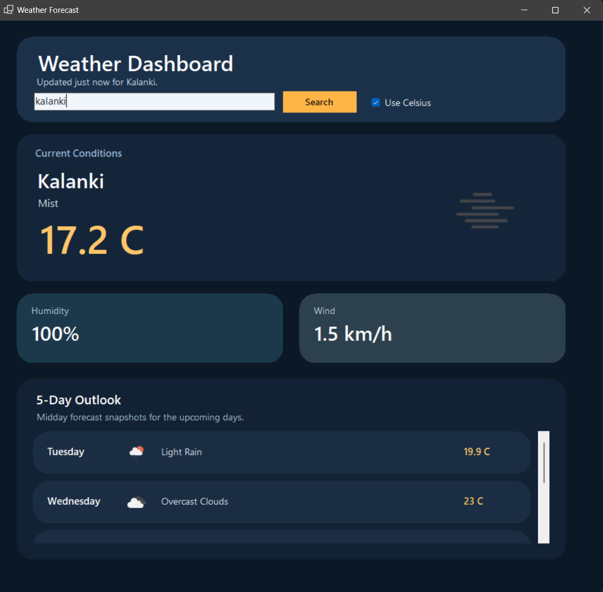

# WeatherApp OOD

WeatherApp OOD is a C# Windows Forms application that displays live weather information for a searched city. The app was built as an Object Oriented Design project and uses the OpenWeather API to load current conditions along with a short forecast in a clean desktop dashboard.

## Overview

This project gives users a simple desktop interface for checking weather conditions in different cities. After entering a city name, the application fetches live weather data and presents it in a visual dashboard with the current temperature, weather description, highs and lows, humidity, wind speed, and a 5-day outlook.

The app is designed around a small service-based structure:

- the UI is handled by the Windows Forms layer
- weather data is retrieved through a weather service interface
- forecast and current-condition data are stored in model classes

This keeps the project organized and makes the code easier to read, maintain, and extend.

## Features

- Search for any city and load live weather data.
- Toggle between Celsius and Fahrenheit before searching.
- View the current temperature and weather description.
- Display the selected city name prominently in the dashboard.
- Show daily high and low temperatures.
- Show humidity and wind speed in separate summary cards.
- Render weather icons returned by the API.
- Display a 5-day forecast using midday forecast snapshots.
- Allow searching by clicking the button or pressing `Enter`.

## How It Works

When a user searches for a city, the application sends requests to the OpenWeather API for:

1. current weather data
2. forecast data

The response is converted into a `WeatherData` object, which stores the current conditions and a collection of daily forecast entries. The form then updates the dashboard labels, cards, icons, and forecast list based on the returned data.

The app currently supports:

- current temperature
- weather condition summary
- high and low temperature
- humidity
- wind speed
- daily forecast entries

## Screenshot



## Project Structure

```text
WeatherApp OOD/
|-- README.md
|-- WeatherApp.sln
|-- WeatherApp/
|   |-- Program.cs
|   |-- Forms/
|   |   `-- WeatherForm.cs
|   |-- Models/
|   |   `-- WeatherData.cs
|   `-- Services/
|       |-- IWeatherService.cs
|       `-- OpenWeatherService.cs
`-- docs/
    `-- weather-dashboard.png
```

## Tech Stack

- C#
- .NET 8
- Windows Forms
- OpenWeather API
- Newtonsoft.Json

## Requirements

- Windows OS
- .NET 8 SDK or Visual Studio with .NET desktop development tools
- Internet connection for API requests

## Getting Started

1. Clone the repository:

```bash
git clone https://github.com/MrFiscus/weatherapp-OOD.git
```

2. Open the solution file:

```text
WeatherApp.sln
```

3. Restore NuGet packages if Visual Studio prompts you.
4. Build and run the `WeatherApp` project.
5. Enter a city name and click `Search`.

## Example Use Case

A user opens the app, types `Chicago`, and searches. The dashboard then displays:

- the current temperature in Chicago
- a short weather description such as cloudy or clear sky
- humidity and wind speed
- the day's high and low
- forecast entries for the next several days

## Design Notes

This project demonstrates a basic object-oriented structure by separating responsibilities across:

- `Forms` for presentation and interaction
- `Services` for API communication
- `Models` for storing weather-related data

Using an interface for the weather service also makes it easier to swap implementations or expand the project later.

## Future Improvements

- Move the API key into configuration instead of hardcoding it.
- Add stronger error handling for invalid city names and network issues.
- Add unit tests for more service and UI logic.
- Support hourly forecast views.
- Add saved or recent city searches.

## Author

Created as an Object Oriented Design course project.
